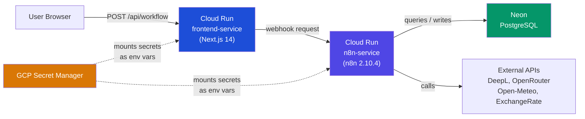
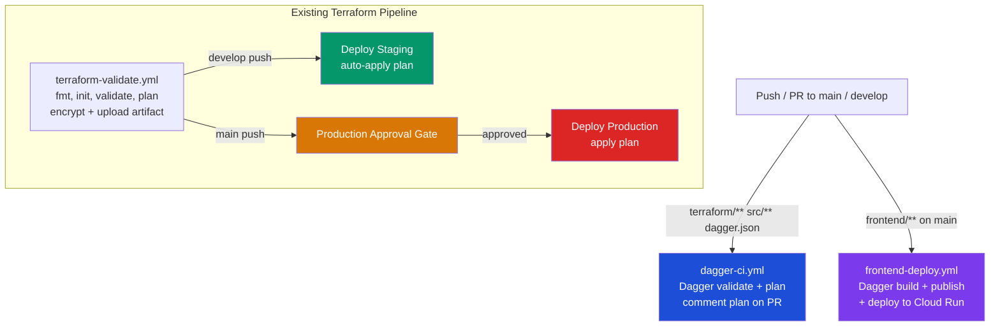

# Poly-CloudOps

A school project to learn modern DevOps infrastructure by building and operating a real cloud-native application.

[](https://deepwiki.com/brendanPro/poly-cloudops)


#### Visit At : https://frontend-service-ud6xcrkoga-ew.a.run.app/

## What it is

An n8n workflow automation hub. A Next.js frontend exposes several automation tools (text translation, QR code generation, JSON-to-Excel conversion, AI text summarization, weather lookup, currency conversion), each backed by an n8n workflow triggered via webhook.

The infrastructure runs on GCP: n8n and the frontend are deployed as separate Cloud Run services, the database is Neon (serverless PostgreSQL), and all secrets are managed by GCP Secret Manager. Everything is provisioned with Terraform and deployed via GitHub Actions.

## Architecture



## CI/CD Pipeline



Supervisor: Brendan Gouin

## Stack

| Layer | Technology |
|---|---|
| Frontend | Next.js 14, Tailwind CSS, deployed on Cloud Run |
| Workflow engine | n8n, deployed on Cloud Run |
| Database | Neon (serverless PostgreSQL) |
| Infrastructure | Terraform (GCP provider + Neon provider) |
| Secrets | GCP Secret Manager |
| CI/CD | GitHub Actions + Dagger + Terraform workspaces |
| Local dev | Docker Compose |
| Package manager | Bun |

## Repository structure

```
frontend/        Next.js application
terraform/       Infrastructure as Code (GCP + Neon)
src/             Dagger module (TypeScript CI/CD functions)
workflows/       n8n workflow JSON exports
bootstrap/       SQL and JS scripts to initialize the n8n admin user
init_db/         SQL run on local Postgres startup
.github/         GitHub Actions workflows
.husky/          Git hooks (commit-msg, pre-push, post-checkout)
docs/            Supplementary documentation
```

## Quickstart (local)

See `docs/running-locally.md` for the full walkthrough.

```bash
bun install                  # installs deps and sets up git hooks
cp .env.development .env     # fill in your credentials
docker compose up -d
```

The n8n UI is at http://localhost:5678, the frontend at http://localhost:3000.

## Branches

| Branch | Purpose |
|---|---|
| `main` | Stable, production-ready. CI deploys to production on merge. |
| `develop` | Integration branch. CI deploys to staging on merge. |
| `feat/frontend` | Frontend development |
| `feat/terraform-cloud-infrastructure` | Terraform / GCP work |
| `ci/*` | CI/CD pipeline work |

Branch names follow the conventional commits format (`<type>/<description>`). The `pre-push` hook blocks pushes with invalid names.

## Commit format

This project enforces [Conventional Commits](https://www.conventionalcommits.org/). The `commit-msg` hook rejects invalid messages.

```
<type>(<scope>): <subject>
```

Valid types: `feat`, `fix`, `docs`, `style`, `refactor`, `perf`, `test`, `build`, `ci`, `chore`, `revert`

## Documentation

- `docs/running-locally.md` — how to run the full stack locally from scratch
- `docs/scaling-and-architecture.md` — Cloud Run scaling, load balancing, serverless cold starts
- `docs/workflows.md` — n8n workflow inventory and how to add a new one
- `docs/ci-cd.md` — CI/CD pipeline, Terraform workspaces, deployment environments

## License

GNU General Public License v3.0
