# CI/CD

This document describes the two GitHub Actions pipelines, how Terraform workspaces map to environments, and the secrets required.

## Pipeline overview

```mermaid
flowchart TD
    subgraph "Dagger CI Pipeline (dagger-ci.yml)"
        A["PR / Push\nterraform/** src/** dagger.json"] --> B["Dagger Validate\nfmt + init + validate"]
        B --> C["Dagger Plan\nplan with all TF_VARs\nsanitize secrets in output"]
        C --> D["Comment plan on PR"]
    end

    subgraph "Dagger Frontend Pipeline (frontend-deploy.yml)"
        I["Push frontend/** to main"] --> J["Validate 7 webhook secrets"]
        J --> K["Dagger build-frontend\nnative pipeline (no Dockerfile)"]
        K --> L["Publish to Artifact Registry"]
        L --> M["Dagger deploy-frontend\ngcloud run deploy"]
    end

    subgraph "Existing Terraform Pipeline (terraform-validate.yml)"
        T["Push terraform/**"] --> U["fmt, init, validate, plan\nencrypt + upload artifact"]
        U --> V{Which branch?}
        V -->|develop| W["Deploy Staging\nauto-apply"]
        V -->|main| X["Production Approval Gate"]
        X -->|approved| Y["Deploy Production\napply plan"]
    end

    style B fill:#1d4ed8,color:#fff
    style C fill:#1d4ed8,color:#fff
    style K fill:#7c3aed,color:#fff
    style M fill:#7c3aed,color:#fff
    style W fill:#059669,color:#fff
    style Y fill:#dc2626,color:#fff
    style X fill:#d97706,color:#fff
```



## Pipelines

### `dagger-ci.yml` — Dagger CI (Terraform validate + plan)

Triggered by:
- Pull requests targeting `main` or `develop` when `terraform/**`, `src/**`, `dagger.json` change
- Manual `workflow_dispatch`

This pipeline runs read-only Terraform operations through the Dagger module.

Steps:
1. Authenticate to GCP via WIF
2. `dagger call validate` — runs `terraform fmt`, `init`, and `validate` inside a Dagger container
3. `dagger call plan` — runs `terraform plan` with all required `TF_VAR_*` secret variables, sanitizes sensitive values from the output, posts the plan as a PR comment

The plan output is sanitized using `sed` to redact any env var value longer than 20 characters, preventing API keys and tokens from leaking in PR comments.

### `terraform-validate.yml` — infrastructure (existing)

Triggered by:
- Push to `main` or `develop` when `terraform/**` changes
- Pull requests targeting `main` or `develop`
- Manual `workflow_dispatch` (lets you pick `staging` or `default` environment)

**Job 1: terraform-validate** (always runs)

1. Authenticate to GCP via Workload Identity Federation (WIF)
2. `terraform fmt -check` — fails if files are not formatted (non-blocking, continues)
3. `terraform init` — uses GCS backend (`polycloudops-terraform-state`)
4. `terraform validate`
5. Select workspace based on branch: `develop` -> `staging`, `main` -> `default`
6. `terraform plan -out=tfplan` — plan against real Neon/GCP credentials
7. Encrypt the plan: `gpg --symmetric --passphrase $PLAN_ENCRYPTION_KEY tfplan`
8. Upload encrypted plan as artifact (`terraform-plan-<workspace>`)
9. If this is a PR, post the plan output as a comment on the PR

**Job 2: terraform-deploy-staging** (runs only on `develop` push)

Requires Job 1 to succeed and workspace to be `staging`.

1. Download and decrypt the plan artifact
2. `terraform apply -input=false tfplan`

**Job 3: terraform-deploy-production** (runs only on `main` push)

Requires Job 1 to succeed, workspace to be `default`, and **manual approval** via the `production` GitHub environment gate.

1. Download and decrypt the plan artifact
2. `terraform apply -input=false tfplan`

The plan is encrypted so it can be safely passed as an artifact between jobs without exposing infrastructure details in the artifact storage.

### `frontend-deploy.yml` — frontend (Dagger)

Triggered by:
- Push to `main` when `frontend/**` changes
- Manual `workflow_dispatch`

This pipeline is a thin Dagger wrapper. All build and deploy logic lives in the Dagger module (`src/index.ts`).

Steps:
1. Validate that all 7 webhook secrets are non-empty (fails fast if any is missing)
2. Authenticate to GCP via WIF
3. Call `dagger call deploy-frontend` which:
   - Builds the Next.js app using native Dagger pipeline operations (no Dockerfile) — installs Bun, runs `bun install`, `bun run build`, produces a standalone output in a multi-stage Container
   - Publishes the image to Artifact Registry with two tags: `$commitSha` and `latest`
   - Runs `gcloud run deploy frontend-service` inside a `google/cloud-sdk` container, passing all 6 webhook URLs as env vars
4. Outputs the deployed service URL

The Dagger module function `buildFrontend()` replicates the multi-stage Dockerfile (`frontend/Dockerfile`) as native Dagger Container API calls:
- **Stage 1 (builder)**: `node:20-alpine` + Bun install + `bun install --frozen-lockfile` + `bun run build`
- **Stage 2 (runner)**: `node:20-alpine` + copies standalone output, static assets, and public directory from the builder container

There is no staging deployment for the frontend — only `main` triggers it.

## Terraform workspaces

The workspace determines which environment Terraform manages:

| Workspace | Maps to | Resource suffix | Branch |
|---|---|---|---|
| `default` | Production | (none) | `main` |
| `staging` | Staging | `-staging` | `develop` |

`local.env_suffix` in `main.tf` is `""` for `default` and `"-staging"` for `staging`. Every resource name that should differ between environments uses `${var.some_name}${local.env_suffix}`.

Both workspaces share the same GCP project (`polycloudops`) but create isolated resources: separate Cloud Run services, Neon projects, secrets, service accounts, VPCs, etc.

## GitHub Secrets required

### Terraform pipeline (used by both dagger-ci.yml and terraform-validate.yml)

| Secret | Description |
|---|---|
| `GCP_WIF_PROVIDER` | Full resource name of the WIF provider |
| `GCP_SERVICE_ACCOUNT` | Service account email that GitHub Actions impersonates |
| `PLAN_ENCRYPTION_KEY` | Passphrase for GPG-encrypting the Terraform plan artifact |
| `NEON_API_KEY` | Neon API key (passed as `TF_VAR_neon_api_key`) |
| `NEON_ORG_ID` | Neon organization ID (passed as `TF_VAR_neon_org_id`) |
| `N8N_ADMIN_PASSWORD` | n8n admin password (passed as `TF_VAR_n8n_admin_password`) |
| `TF_VAR_WIF_PROVIDER_NAME` | WIF provider name (passed through to Terraform outputs) |
| `TF_VAR_WIF_SERVICE_ACCOUNT_EMAIL` | WIF service account email (passed through to Terraform outputs) |

### Frontend pipeline

| Secret | Description |
|---|---|
| `GCP_WIF_PROVIDER` | Same as above |
| `GCP_SERVICE_ACCOUNT` | Same as above |
| `N8N_TRANSLATE_WEBHOOK_URL` | n8n webhook URL for translation |
| `N8N_QR_WEBHOOK_URL` | n8n webhook URL for QR generation |
| `N8N_JSON_EXCEL_WEBHOOK_URL` | n8n webhook URL for JSON-to-Excel |
| `N8N_SUMMARIZE_WEBHOOK_URL` | n8n webhook URL for AI summarizer |
| `N8N_WEATHER_WEBHOOK_URL` | n8n webhook URL for weather |
| `N8N_CURRENCY_WEBHOOK_URL` | n8n webhook URL for currency conversion |

## Workload Identity Federation

WIF allows GitHub Actions to authenticate to GCP without storing a long-lived service account key. The workflow requests a short-lived OIDC token from GitHub, which GCP validates against the WIF pool/provider configuration.

WIF is managed **outside Terraform** (it was set up manually or before the Terraform state was established). The WIF provider name and service account email are referenced in Terraform as variables but not created by it. If you need to recreate the WIF setup, do it via `gcloud` and then update the GitHub Secrets.

The access token lifetime is set to 600s for the validate job and 1200s for deploy jobs (apply can take time with Neon provisioning).

## First-time setup checklist

If you're setting up CI/CD from scratch on a new fork or project:

1. Create the GCS bucket for Terraform state:
   ```bash
   gcloud storage buckets create gs://polycloudops-terraform-state \
     --project=polycloudops \
     --location=europe-west1 \
     --uniform-bucket-level-access
   ```

2. Create the WIF pool and provider, create the Terraform service account, grant it the necessary roles.

3. Create the Artifact Registry repository:
   ```bash
   gcloud artifacts repositories create n8n-repo \
     --repository-format=docker \
     --location=europe-west1 \
     --project=polycloudops
   ```

4. Create the manually-managed GCP Secret Manager secrets (empty versions are fine, Terraform will populate DB secrets):
   - `n8n-encryption-key`
   - `deepl-api-key`
   - `n8n-db-connection-string`
   - `db-host`, `db-user`, `db-password`, `db-database`

5. Set all GitHub Secrets listed above.

6. Push to `develop` to trigger a staging deploy. Review the Terraform plan comment on the PR or in the Actions log.

7. Merge to `main`, approve the production environment gate, and the production deploy will run.
