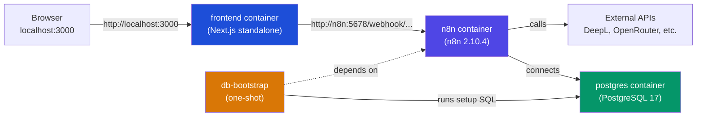

# Running locally

This document covers running the full Poly-CloudOps stack on your machine.

## Local architecture



All four services run on a shared Docker bridge network (`cloudops-network`). The frontend reaches n8n via the internal hostname `n8n`, not `localhost`.

## Prerequisites

- [Bun](https://bun.sh) — package manager, used for the root monorepo and the frontend
- [Docker](https://docs.docker.com/get-docker/) with the Compose plugin
- A DeepL free API key (only needed if you want the translation workflow to work)

## 1. Clone and install

```bash
git clone <repo-url>
cd poly-cloudops
bun install
```

`bun install` at the root sets up the Husky git hooks. You do not need to run it inside `frontend/` for local dev — Docker Compose builds the frontend image directly.

## 2. Configure environment

```bash
cp .env.development .env
```

Open `.env` and fill in:

```
N8N_ADMIN_EMAIL=admin@example.com
N8N_ADMIN_PASSWORD=choose-a-strong-password
N8N_ENCRYPTION_KEY=<output of: openssl rand -base64 24>
DEEPL_API_KEY=<your-deepl-free-key>
```

The Postgres variables (`PGHOST`, `PGUSER`, etc.) are pre-filled for the local Compose stack and should not need changing unless you rename the containers.

## 3. Start the stack

```bash
docker compose up -d
```

This starts four services:

| Service | Port | Description |
|---|---|---|
| `postgres` | 5432 | Local PostgreSQL for n8n |
| `n8n` | 5678 | n8n workflow engine |
| `db-bootstrap` | — | One-shot container that sets the n8n admin user |
| `frontend` | 3000 | Next.js frontend |

The `db-bootstrap` service runs after n8n is healthy, executes `bootstrap/setup-n8n.sql` against the local Postgres, and exits. It will not restart.

```bash
docker compose logs -f        # stream all logs
docker compose logs n8n -f    # n8n only
docker compose ps             # check health status
```

## 4. Import n8n workflows

n8n starts empty. You need to import the workflows manually:

1. Open http://localhost:5678 and log in with the credentials from your `.env`
2. Go to **Workflows** -> **Import from file**
3. Import each JSON file from `workflows/`:
   - `translate-text-deepl.json`
   - `ai-text-summarizer.json`
   - `json-to-excel.json`
4. Activate each workflow (toggle the switch in the top-right of the workflow editor)

The weather and currency workflows are not committed to the repo. They only exist in the live GCP instance. You will need to create them manually if you want to test those locally — see `docs/workflows.md`.

## 5. Configure frontend webhook URLs

The frontend reads webhook URLs from environment variables. For local dev, these are set directly in the Docker Compose file for the two committed workflows. For the others you need a `frontend/.env.local`:

```bash
cp frontend/.env.local.example frontend/.env.local   # if the example exists
# or create it manually:
cat > frontend/.env.local << 'EOF'
N8N_TRANSLATE_WEBHOOK_URL=http://localhost:5678/webhook/translation
N8N_QR_WEBHOOK_URL=http://localhost:5678/webhook/generateQr
N8N_JSON_EXCEL_WEBHOOK_URL=http://localhost:5678/webhook/c1616754-4dec-4b00-a8b5-d1cb5f75bf11
N8N_SUMMARIZE_WEBHOOK_URL=http://localhost:5678/webhook/ai-summarizer
N8N_WEATHER_WEBHOOK_URL=http://localhost:5678/webhook/weather
N8N_CURRENCY_WEBHOOK_URL=http://localhost:5678/webhook/currency
EOF
```

Note: the Docker Compose `frontend` service uses container networking (`http://n8n:5678/...`). If you run the frontend with `bun dev` outside Docker, use `http://localhost:5678/...` instead.

## 6. Frontend dev mode (without Docker)

If you want hot-reload during frontend development:

```bash
# Make sure the rest of the stack is running via Docker Compose
docker compose up -d postgres n8n db-bootstrap

# Then run the frontend outside Docker
cd frontend
bun dev
```

The frontend will be at http://localhost:3000 with hot-reload.

## Stopping

```bash
docker compose down          # stop and remove containers
docker compose down -v       # also remove volumes (wipes the database)
```

## Common issues

**n8n is stuck at "Starting..."** — it waits for Postgres to be healthy. Check `docker compose logs postgres`. If the data volume has corrupt state, run `docker compose down -v` and start fresh.

**db-bootstrap failed / can't log in to n8n** — the bootstrap runs only once after n8n becomes healthy. If it failed, check `docker compose logs db-bootstrap`. You can re-run it manually:

```bash
docker compose run --rm db-bootstrap
```

**Webhook returns 404** — the workflow is not activated. Open the n8n UI, open the workflow, and toggle it to active.

**Frontend can't reach n8n** — if running `bun dev` outside Docker, ensure you're using `http://localhost:5678` in `.env.local`, not `http://n8n:5678` (that hostname only works inside the Docker network).
