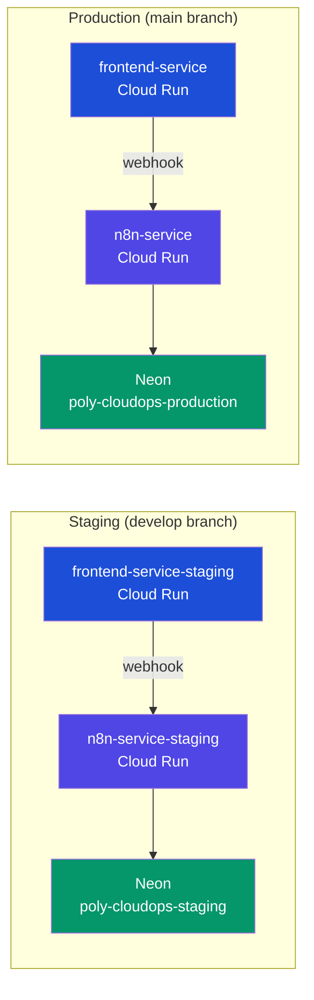

# Scaling and architecture

This document covers how the production infrastructure scales, handles load, and deals with the constraints of serverless containers.

## Overview

Both the frontend and n8n run as Cloud Run services in `europe-west1`. Cloud Run is a serverless container platform: it manages instances automatically, scales to zero when idle, and scales out under load.

```
Internet -> Cloud Run (frontend-service) -> Cloud Run (n8n-service) -> Neon (PostgreSQL)
```

There is no traditional load balancer in front of Cloud Run. GCP manages HTTP/2 ingress, TLS termination, and request routing to instances transparently. From the outside you get a single HTTPS URL per service.

## Environment topology



Both environments share the same GCP project (`polycloudops`) but use isolated resources: separate Cloud Run services, separate Neon projects, separate Secret Manager secrets, separate VPCs. The `-staging` suffix is appended automatically by Terraform's `local.env_suffix`.

## Cloud Run scaling

Cloud Run scales based on concurrent requests per instance. The relevant Terraform variables:

| Variable | Default | Effect |
|---|---|---|
| `cloudrun_min_instances` | `0` | Scales to zero when idle — cold starts apply |
| `cloudrun_max_instances` | `10` | Hard cap on concurrent instances |
| `cloudrun_concurrency` | `80` | Max requests per instance before a new one is spawned |
| `cloudrun_cpu` | `1` | vCPUs per instance |
| `cloudrun_memory` | `1Gi` | RAM per instance |
| `cloudrun_timeout` | `300s` | Max request duration |

When a request arrives and no instance is running, Cloud Run starts a new one (cold start). Once running, it handles up to 80 concurrent requests before Cloud Run spawns an additional instance. When traffic drops, idle instances are shut down after a short grace period.

## Cold starts

Both services start from zero (`min_instance_count = 0`). This means the first request after a period of inactivity will wait for the container to boot.

**n8n cold start** is the more significant one. n8n loads its workflow definitions, connects to Neon over SSL, and runs its own startup checks. Depending on the machine it boots on, this typically takes 10–30 seconds. The Terraform config mitigates this with:

- `startup_cpu_boost = true` — gives the instance extra CPU during startup
- `startup_probe` with `initial_delay_seconds = 20` and `failure_threshold = 10` — gives n8n 70 seconds to become healthy before Cloud Run kills the instance
- `liveness_probe` with `initial_delay_seconds = 30` — only starts checking health after 30s

**Frontend cold start** is fast (~1–2 seconds) because Next.js in standalone mode is a small Node process.

To avoid cold starts entirely, set `cloudrun_min_instances = 1`. This keeps one instance warm at all times but incurs continuous cost.

## Request flow in detail

1. User submits a form in the browser
2. Browser POST to `https://frontend-service.../api/<workflow>`
3. Next.js API route (server-side) reads `process.env.N8N_<WORKFLOW>_WEBHOOK_URL`
4. Next.js makes a server-to-server POST to the n8n Cloud Run URL
5. n8n executes the workflow, calls external API (DeepL / OpenRouter / etc.)
6. n8n returns the result to Next.js
7. Next.js normalizes the response and returns JSON to the browser

The frontend and n8n talk over the public internet (Cloud Run service URLs), not over a private VPC connector. The VPC defined in Terraform exists for future private connectivity — it is not currently wired to the Cloud Run services.

## Database: Neon

Neon is a serverless PostgreSQL service. It also scales to zero — the compute endpoint suspends after a period of inactivity and resumes on the next connection.

n8n connects to Neon using the **connection pooler** endpoint (`database_host_pooler`), which is recommended for serverless workloads because it maintains a pool of connections even when n8n instances come and go. Direct connections (`database_host`) are also available but less efficient under variable load.

SSL is required (`sslmode=require`, `DB_POSTGRESDB_SSL_REJECT_UNAUTHORIZED=false` to accept Neon's certificate without strict hostname verification).

Only the translation workflow writes to the database (`public.translations` table). All other workflows are stateless — they call external APIs and return results directly.

## Two n8n URLs in production

The `frontend/.env.local` shows two different Cloud Run n8n URLs. This happened because the service was redeployed at some point, generating a new URL. Both URLs may resolve to the same service or to different revision URLs. In production via CI, all webhook URLs are set from GitHub Secrets, so this is only relevant locally. When deploying fresh, update the secrets to point to the current `n8n-service` URL from `terraform output n8n_service_url`.

## Environments

Terraform workspaces isolate staging from production:

| Workspace | Branch | Resources |
|---|---|---|
| `default` | `main` | `n8n-service`, `n8n-vpc`, etc. |
| `staging` | `develop` | `n8n-service-staging`, `n8n-vpc-staging`, etc. |

Both environments use separate Neon projects (`poly-cloudops-staging` and `poly-cloudops-production`), separate Secret Manager secrets, and separate Cloud Run services. They share the same GCP project (`polycloudops`).

The frontend currently only has one Cloud Run service (`frontend-service`) deployed from `main`. There is no staging deployment of the frontend.
