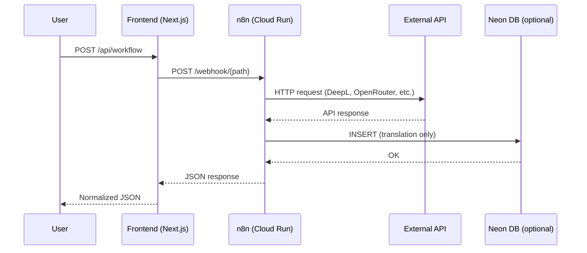

# n8n workflows

This document describes each workflow, its webhook path, what it does, and how to add a new one.

## Request flow

Every workflow follows the same path:



## Workflow inventory

### Translation (`translate-text-deepl.json`)

- Webhook path: `POST /webhook/translation`
- Env var: `N8N_TRANSLATE_WEBHOOK_URL`
- Flow: receives `{ text, target_lang }` -> calls DeepL free API -> inserts into `public.translations` in Neon -> returns `{ translated_text }`
- External dependency: DeepL API key (`DEEPL_API_KEY` env var on the n8n container)
- Only workflow that writes to the database

### QR Code Generator

- Webhook path: `POST /webhook/generateQr`
- Env var: `N8N_QR_WEBHOOK_URL`
- Flow: receives `{ data }` -> generates QR code image -> returns binary image or base64
- Not committed to `workflows/`. Exists only in the live n8n instance. Export it if you modify it.

### JSON to Excel (`json-to-excel.json`)

- Webhook path: `POST /webhook/c1616754-4dec-4b00-a8b5-d1cb5f75bf11`
- Env var: `N8N_JSON_EXCEL_WEBHOOK_URL`
- Flow: receives a JSON array -> splits into items -> converts to `.xlsx` binary -> returns file with `Content-Disposition: attachment` header
- The frontend passes a `?filename=` query parameter; the workflow uses it to name the download
- The webhook path is a UUID (generated by n8n), not a human-readable slug

### AI Text Summarizer (`ai-text-summarizer.json`)

- Webhook path: `POST /webhook/ai-summarizer`
- Env var: `N8N_SUMMARIZE_WEBHOOK_URL`
- Flow: receives `{ text }` -> LangChain Summarization Chain -> OpenRouter (`openai/gpt-oss-20b:free`) -> returns `[{ output: { text: "..." } }]`
- External dependency: OpenRouter API key stored as n8n credentials (not an env var)
- Response format is the LangChain array format; the frontend extracts `result[0].output.text`

### Weather Forecast

- Webhook path: `POST /webhook/weather`
- Env var: `N8N_WEATHER_WEBHOOK_URL`
- Flow: receives `{ city }` -> resolves coordinates -> calls Open-Meteo API -> returns weather data object
- Not committed to `workflows/`. Exists only in the live n8n instance. Export it if you modify it.
- Open-Meteo is free and requires no API key

### Currency Converter

- Webhook path: `POST /webhook/currency`
- Env var: `N8N_CURRENCY_WEBHOOK_URL`
- Flow: receives `{ amount, from, to }` -> calls ExchangeRate-API -> returns conversion result
- Not committed to `workflows/`. Exists only in the live n8n instance. Export it if you modify it.

## Adding a new workflow

### 1. Build the workflow in n8n

Use the n8n UI (locally or on the live instance). Use a **Webhook** trigger node with a meaningful path slug. Use **Respond to Webhook** (not "last node") if you need a custom response.

### 2. Export and commit the JSON

In the n8n UI: open the workflow -> three-dot menu -> **Download**. Save it to `workflows/<name>.json`.

### 3. Add the frontend page

Create `frontend/app/<workflow>/page.tsx`. It should be a client component that:
- Calls `/api/<workflow>` via `fetch`
- Handles loading, error, and result states
- Follows the same pattern as the existing pages

### 4. Add the API route

Create `frontend/app/api/<workflow>/route.ts`. It should:
- Read the webhook URL from `process.env.N8N_<WORKFLOW>_WEBHOOK_URL`
- Proxy the request to n8n
- Normalize the response before returning it to the client
- Return meaningful HTTP status codes on errors

### 5. Register the workflow in the hub

Add an entry to `frontend/lib/workflows-data.ts`:

```typescript
{
  id: 'my-workflow',
  name: 'My Workflow',
  description: 'What it does in one sentence.',
  category: 'text' | 'image' | 'data' | 'automation',
  status: 'active',
  color: { primary: '#...', secondary: '#...', accent: '#...' },
  gradient: ['#...', '#...'],
  path: '/my-workflow',
  icon: '...'
}
```

### 6. Add the secret

Add `N8N_<WORKFLOW>_WEBHOOK_URL` to:
- GitHub Secrets (Settings -> Secrets and variables -> Actions)
- The `frontend-deploy.yml` workflow: both the validation list and the `--set-env-vars` deploy command

### 7. Note on `next.config.mjs`

The `env` block in `next.config.mjs` only contains `N8N_TRANSLATE_WEBHOOK_URL` and `N8N_QR_WEBHOOK_URL`. Do not add new webhook URLs there — they should remain server-only (used only in API routes, never sent to the browser).

## Exporting missing workflows

The QR, weather, and currency workflows are not in the repo. To export them from the live instance:

1. Log into the n8n instance
2. Open the workflow
3. Three-dot menu -> Download
4. Save to `workflows/<name>.json` and commit

This ensures the workflows can be reproduced if the n8n instance is lost or reset.
